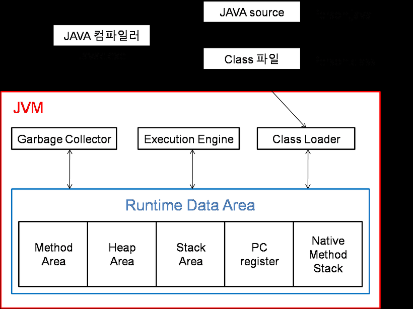
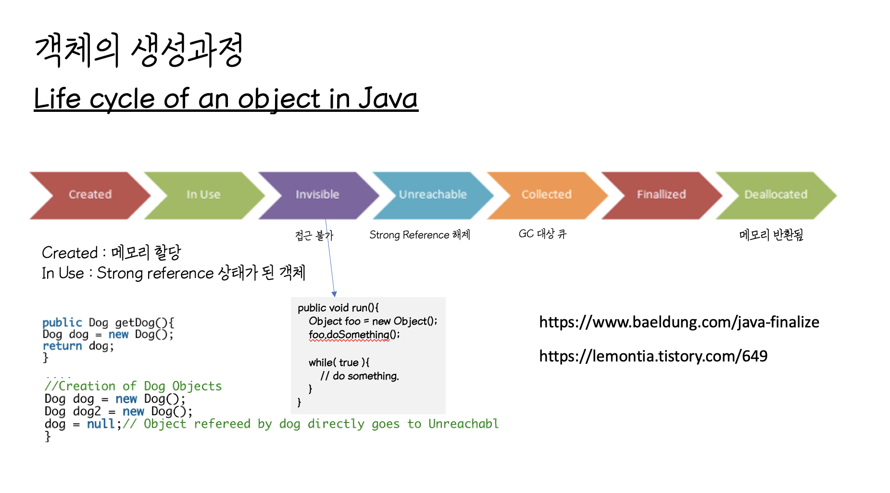
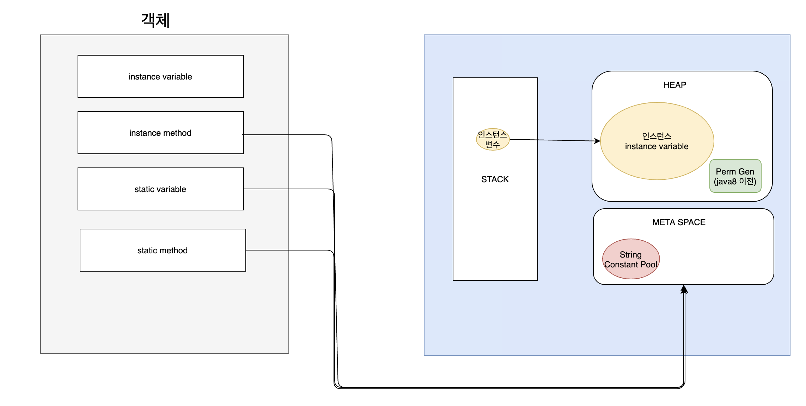

# 객체를 생성할 때의 내부 동작을 알아보자

> 객체 생성 과정을 알아보기 전에 우선 JVM의 구조부터 간단하게 알고 가자.

 

## JVM 구조

https://img1.daumcdn.net/thumb/R1280x0/?scode=mtistory2&fname=https%3A%2F%2Fblog.kakaocdn.net%2Fdn%2FpjywN%2FbtqSduBXLIK%2F2QEL5c2nEJXRm0cyhvwxF1%2Fimg.png

 

## 객체 생성 및 소멸 과정

https://blog.kakaocdn.net/dn/bxcjlw/btq79EIIZNh/W0x2QPeK6zpLqbBWFZmHuk/img.png

 

### Step 01. Created
객체 생성을 뜻하며 객체가 생성되면 사용할 준비가 되고, JVM 메모리에서 Heap 영역에 저장된다.

 

### Step 02. In Use
객체가 생성되어, 다른 객체에 참조되어 있는 상태

위 코드에서는 Dog 라는 객체는 사용 중 이라고 볼 수 있으며

사용 중인 객체는 GC(Garbage Collection) 대상에서 제외된다.

Created 단계와의 차이점은, 객체가 생성 될 때 사용 중이거나 사용하지 않는 상태 일 수 있다.

객체를 생성하고 참조하는 부분이 없다면 In Use 상태로 볼 수 없다.

 

### Step 03. Invisible
모든 객체가 거쳐가는 상태는 아니다.

Strong Referenced 가 되어 있다.

** Strong Referenced 란? : 일반적으로 new 를 통해서 객체를 생성하면 생기는 참조이다.

직접 접근할 수 없는 상태이며, GC(Garbage Collection)의 대상이 되지 않는다.

 

### Step 04. Unreachable
Strong Reference 가 해제되고, GC(Garbage Collection)의 후보가 된 상태이다.

** GC 후보가 되면 즉시 GC가 되진 않지만 GC 큐에 삽입된다.

 

### Step 05. Collected
메모리 해제 단계의 도입 부분이다.

GC(Garbage Collection)가 객체의 finalize()가 정의 되어있는지 판단한다.

이때 객체에 **finalize() 메서드가 있다면**

**finalizer 라는 Queue 에 삽입**하고,

그렇지 않으면 바로 다음 단계인 **finalized** 상태로 전환 시킨다.

** finalize()는 객체가 소멸될 때 호출되기로 약속된 메서드 이다.

** finalize() 메서드는 사용하고 있는 Resource를 정리하기 위한 메서드이다. (사용 권장되는 메서드는 아니다.)

 

### Step 06. Finallized
finalizer 를 통해 finalize 가 실행 된 후의 상태이다. finalize 는 Collected 상태로

바로 수행 되는 것이 아니라, finalizer 의 Queue 에 삽입되는 것이다.

finalizer 는 데몬 쓰레드로, 객체가 메모리에서 제거되기 전에 사용하는 리소스를 해제하는 역할을 수행한다.

 

### Step 07. Deallocated
메모리 반환이 끝난 상태로 GC(Garbage Collection)이 마무리된 상태이다.

 

---

## 객체가 위치한 장소는?

https://blog.kakaocdn.net/dn/bfxkeJ/btrdSRQBGMl/Ppkt8slNwz2JrlrUYGBsr0/img.png

### Heap
new 라는 키워드로 생성된 객체가 저장되는 장소이다.

문자열 상수 풀, 필드와 인스턴스 변수 또한 이곳에 저장된다.

### MetaSpace(Method Area)
static data, 클래스 변수와 static 메서드를 저장한다.
Heap 영역과, JVM Stack 영역에서 접근 가능하다.

### JVM Stack
현재 실행중인 프로그램이 담겨있다.
지역변수가 담겨있다
쓰레드 형식으로 존재한다.

### Native Stack
기본 메서드 실행에 사용된다.
쓰레드 형식으로 존재한다.

### PC Register / Instruction Sets
JVM 메모리 주소를 가지고 있고, 스택에 각 JVM 명령어를 담고있다.

---