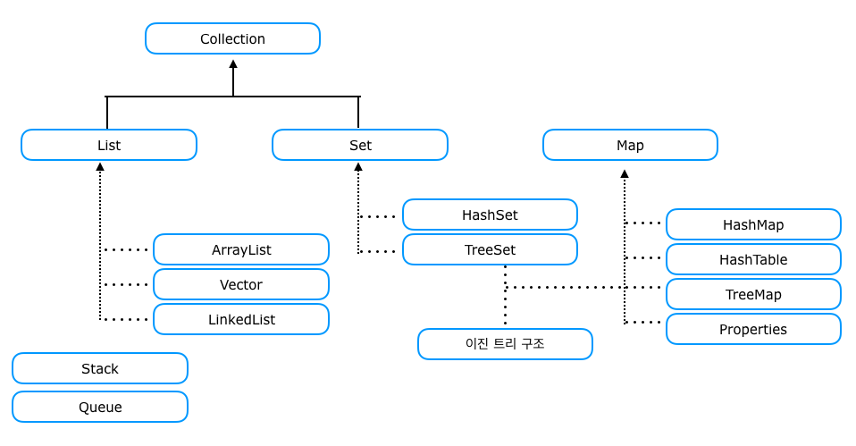

# 컬렉션 프레임워크란

Stack, Queue, Map 등 널리 알려진 자료구조를 바탕으로 객체나 데이터를 효율적으로 관리할 수 있는 기능을

구현해놓은 라이브러리

---

### 이 글에선, 대표적으로 List, Map 을 다룬다

---

# List

## [ 개요 ]

ArrayList, LinkedList, Vector 의 인터페이스이다. (Vector 는 하위 호환때문에 존재함 권장하지 않음)

## [ 기본 메서드 ]

    //주어진 객체를 맨 끝에 추가
    boolean add(E e)

    //주어진 인덱스에 객체를 추가
    void add(int index, E element)

    //값 할당 OR 재설정
    set(int index, E element)

    //주어진 객체가 있는지에 대한 여부를 검색
    boolean contains(Object o)

    //저장된 객체를 리턴
    E get(int index)

    //컬렉션이 비어있는지 확인
    isEmpty()

    //전체 객체의 수를 리턴
    int size()

    //주어진 인덱스의 객체를 삭제
    E remove(int index)

    //주어진 인덱스에 저장된 객체를 삭제
    void clear()

    //주어진 객체를 삭제
    boolean remove(Object o)

---

## List - [ ArrayList ]
List 인터페이스를 상속받은 클래스로, 크기가 가변적으로 변하는 선형리스트이다.

### ArrayList Definition

    ArrayList list = new ArrayList();
    
    ArrayList<Student> members = new ArrayList<Student>(); // Type Setting -> Student
    ArrayList<Integer> num = new ArrayList<Integer>(); // Type Setting -> Integer
    ArrayList<Integer> num2 = new ArrayList<>(); // Type parameter 생략
    ArrayList<Integer> num3 = new ArrayList<>(10); //초기 용량 설정

### ArrayList Specification

ArrayList 의 초기 용량을 설정하지 않고 초기화를 해주면, 초기 용량은 10으로 기본값 셋팅되어있다.

이때 ArrayList 에 add 연산을 하여 초기값 크기보다 커지게 되면

ArrayList 의 크기를 50%정도 늘린다.

따라서 미리 사용할 용량을 예쌍하고 초기값을 설정 하면 조금의 성능 향상이 가능하다.

-> 배열의 사이즈를 늘리는과정에서 수행하게되는 copy 하는 과정이 없기 때문이다.

> 다음 소개할 LinkedList 에 비해 검색연산에 대한 성능은 더 우위에 있다.
> 하지만 삽입/삭제 연산에서는 느리다. 
> 
> 이 이유는 다음과 같은 내부 동작과정 때문에 그렇다.
> 
> 기존 데이터를 복사하여 newCapacity(즉, add, delete 후의 ArrayList 크기)에 재할당한다.

---

## List - [ LinkedList ]
List 인터페이스를 상속받은 클래스로

데이터를 노드로 구분하는데, 노드는 Head, Data, Tail 로 구성되어있다.

Head 에는 이전노드를 가리키는 포인터

Tail 에는 다음 노드를 가리키는 포인터가 담겨있다.

### LinkedList Definition

    LinkedList list = new LinkedList();

    LinkedList<Student> members = new LinkedList<Student>();
    LinkedList<Integer> num = new LinkedList<Integer>();
    LinkedList<Integer> num2 = new LinkedList<>();
    LinkedList<Integer> list2 = new LinkedList<Integer>(Arrays.asList(1,2)); //생성시 값추가

### LinkedList Specification

LinkedList 는 양방향 LinkedList 로 구성되어 있다. (Double LinkedList)

> 추가/삭제 연산에서의 장점**을 가지고 있는데 이 이유는 다음과 같다.
>
> 추가할 노드가 있다면 **마지막 노드의 Tail 의 포인터만 추가할 노드로** 가리켜 주기면 하면 되기 때문이다.
>
> [!] 값 추가 시 add 연산 중 **last** 라는 변수가 있는데 이 변수가, 마지막 노드의 위치를 가리켜 곧바로 그 뒤에 추가할 수 있게된다.
>
> 삭제할 노드가 있다면 **삭제할 노드**의 다음 노드에다가 링크를 다시 이어붙여주면 되기 때문이다.

---

## List - [ Summary -- ArrayList vs LinkedList ]

| 연산구분    | ArrayList | LinkedList |
|---------|-----------|------------|
| add     | -         | 비교적 빠름     |
| delete  | -         | 비교적 빠름     |
| search | 비교적 빠름    | -          |

---

# Map

## [ 개요 ]

Map 은 리스트나 배열처럼 순차적으로(sequential) 해당 요소 값을 구하지 않고 key 를 통해 value 를 얻는다.

맵(Map)의 가장 큰 특징이라면 key 로 value 를 얻어낸다는 것이 있다.

HashMap, HashTable, TreeMap 의 인터페이스이다.

## [ 기본 메서드 ]

    // 주어진 키와 값을 추가하여 저장되면 값을 리턴
    V put(K Key, V value)

    // 주어진 키가 있는지 확인
    boolean containsKey(Object Key)

    // 주어진 값이 있는지 확인
    boolean containsValue(Object value)

    // 모든 Map.Entry 객체를 Set에 담아 리턴
    Set<Map.Entry<K,V>> entrySet() 	

    // 모든 키를 Set객체에 담아서 리턴
    Set<K> keySet()

    // 주어진 키에 있는 값을 리턴
    V get(Object key)
    
    //컬렉션이 비어있는지
    boolean isEmpty() 	

    // 저장되어 있는 전체 객체의 수를 리턴
    int Size()

    // 저장된 모든 값을 Collection에 담아서 리턴
    Collection<V> values()

    // 저장된 모든 Map.Entry를 삭제
    void clear()

    // 주어진 키와 일치하는 Map.Entry를 삭제
    V remove(Object Key)

---

## Map - [ HashMap ]

HashMap 은 put 한 순서가 보장되지 않는다.

HashMap 에서 특정 값을 찾는 내부 로직은

> Key 값과 Hash 값을 비트연산(AND) 연산을 통해 인덱스를 구한다.

---

## Map - Definition

    HashMap<String,String> map1 = new HashMap<String,String>();

    HashMap<String,String> map2 = new HashMap<>();

    HashMap<String,String> map3 = new HashMap<>(map1);

    HashMap<String,String> map4 = new HashMap<>(10);

    HashMap<String,String> map5 = new HashMap<>(10, 0.7f);

    HashMap<String,String> map6 = new HashMap<String,String>(){{
    put("a","b");
    }};

### Arraylist vs HashMap Search Compare

> Arraylist 는 for 문으로 다 돌아야한다.
>
> HashMap 은 Key 값에 대하여 비트연산을 하여 성능이 아주아주 빠르다.

### HashMap - Specification

> HashMap 테이블에 동일한 해시가 중복이 되더라도, 중복된 인덱스에 LinkedList 로 이어져 달려있기때문에
>
> .next 같은 다음 노드 조회연산으로 빠르게 조회가 가능하다.

데이터가 계속 추가되면 느리다... 

노드를 늘리면 해시가 바뀌게 되어 모든 노드들의 데이터가 재할당되어야하기 때문이다.

-> 초기사이즈를 지정하여 성능 이슈를 줄일 수도 있다.

