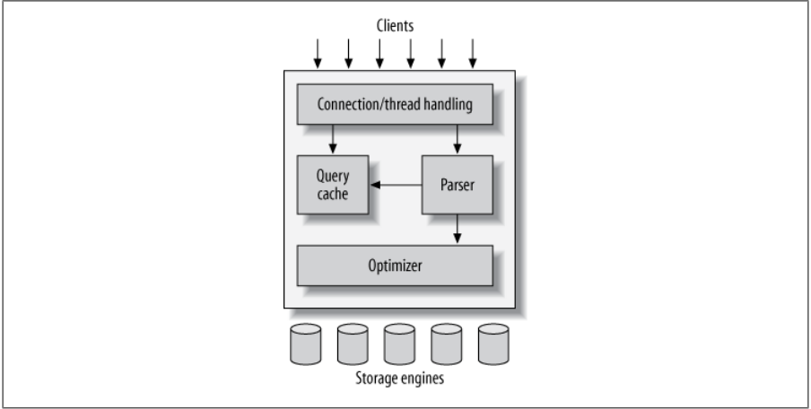

# MySQL 내부 구조

https://shashwat-creator.medium.com/mysqls-logical-architecture-1-eaaa1f63ec2f

---

---

## 첫번째 계층 - Client

Client-Server 모델에서는, 네트워크 도구에 의한 Connection Handling, Authentication, Security 이 제공되어야 한다.

## 두번째 계층 - Server

쿼리 파싱, 분석, 최적화, 캐싱 및 내장된 모든 기능(date, time, math, encryption) 을 수행한다.

## 세번째 계층 - Storage-Engines

모든 데이터를 저장하고, 검색하는 역할을 수행한다.

MyISAM, InnoDB 라는 두가지의 엔진을 가장 많이 사용한다. MySQL 서버는 API 를 통해 Storage Engine 과 통신한다.

---

## MySQL 에서 쿼리를 보내면 어떤 일이 벌어지는가?

1. 클라이언트는 SQL 을 서버로 보낸다.

2. 서버는 쿼리 캐시를 확인 후, 캐시히트하면 저장된 결과를 반환한다. 
그렇지 않으면 SQL 문을 다음 단계로 전달합니다.

3. 서버는 쿼리 실행 계획으로 SQL 파싱, 사전 처리 및 최적화한다.

4. 쿼리 실행 엔진은 스토리지 엔진 API 를 호출하여 계획을 실행합니다.

5. 서버는 결과를 클라이언트에 보낸다.

---

